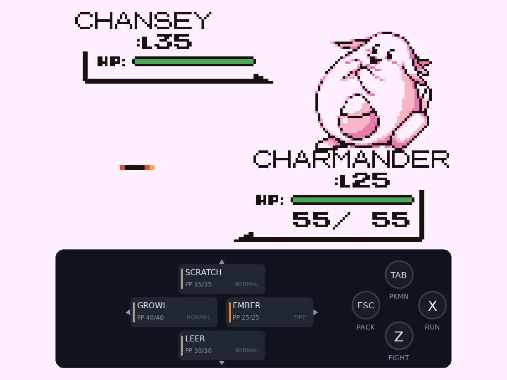
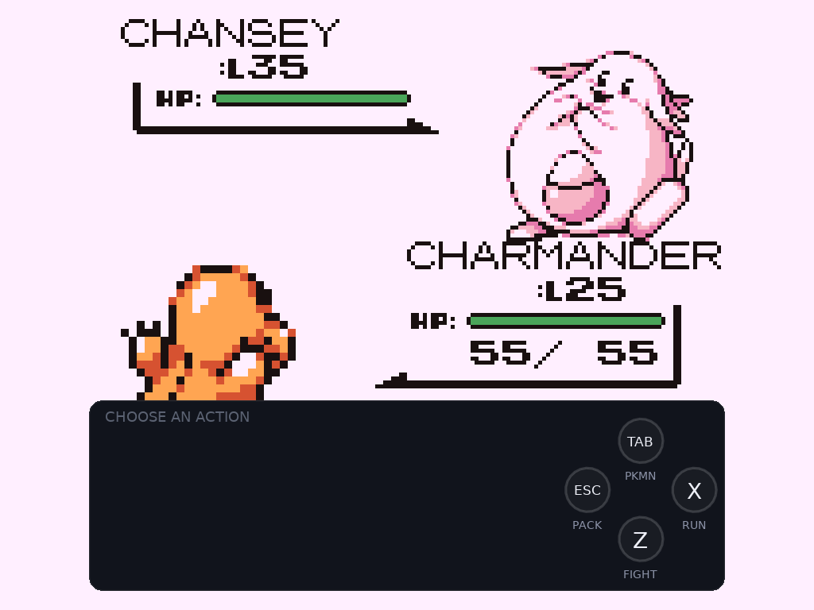
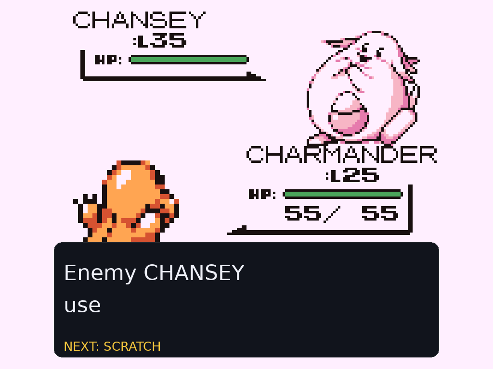

# BattlePad

**Shortcuts for the battle menu: moves and battle actions mapped straight
to your controller.**



A **battle UI overhaul** for the Pokémon Gen 1 Recompilation Project, for
**Red, Blue, Yellow and Gold**.  Every menu surface of a battle wears a
modern skin while the scene above it stays exactly the engine's own, and
every choice runs the vanilla battle code underneath.

**Who it is for:** anyone who plays battles on a gamepad and wants the turn
they already decided on to be one press away.

## Try it

```sh
# 1. drop it in (or install the .modpkg from the releases page)
cp -r battlepad mods/battle_pad

# 2. play: start any battle and press A
love .
```

## The controls

| Input | Command step | Move compass (after FIGHT) |
|---|---|---|
| Face button south (A / cross) | FIGHT — open the compass | confirm the highlight |
| Face button east (B / circle) | **hold** to RUN | back to commands |
| Face button north (Y / triangle) | POKEMON | POKEMON |
| Face button west (X / square) | PACK | PACK |
| D-pad north / west / east / south | — | move 1 / 2 / 3 / 4 |
| Left stick | — | radial move select |
| Right stick | radial command select | radial command select |

A tap highlights and shows PP and type; the same input again (or A) commits.
**QUICK MOVES** in OPTIONS makes one tap fire the move.  Keyboard players
keep everything — arrows, Z, X, TAB, ESC — with the keys shown on the
buttons themselves.  The face-button glyphs match the pad in your hands:
Xbox letters, PlayStation shapes, Nintendo letters, detected live.

## Queueing

While the foe attacks, the text has the screen to itself — and the compass
stays live underneath: pick now, and the choice fires the instant the menu
returns, dissolving quietly if the situation changed.  The amber NEXT tag
is the whole indicator.  B clears it.




## How it works

BattlePad is a puppeteer, not a rewrite.  On Gen 1, committed choices are
fed through the vanilla update loop as synthetic presses; on Gold they call
the battle screen's own semantic entry points.  Ghost battles, trapping
locks, Struggle, disabled moves and the forced switch after a faint all run
the engine's own code paths, and the first error in any BattlePad frame
stands the mod down for that battle — the vanilla menu carries on.

## Options

**BATTLEPAD** on/off · **QUICK MOVES** one-tap moves · **QUEUE NEXT** ·
**STICKS** (AUTO/ON/OFF beside voxel camera mods) · **3D BATTLES**
(BATTLEPAD/CLASSIC inside Dramatic Shape staged battles) · **DEBUG LOG**
(session trail + on-screen crash panel) · **PAD ICONS** (AUTO/XBOX/PS/NIN).

## Status

| Surface | State |
|---|---|
| Command deck + move compass | ✅ Red / Blue / Yellow / Gold |
| Radial sticks, queueing, hold-to-run | ✅ |
| Battle bag / party / text skins | ✅ Gen 1 (Gold keeps its native screens) |
| Safari, old-man demo, Mimic, Bug Contest | classic UI on purpose |
| USEFUL_BATTLE_CAM | declared incompatible — both want the sticks |

## Licence

MIT — see [LICENSE](LICENSE).  BattlePad ships only its own code and draws
its whole interface at runtime; it contains no ROM-derived bytes.
